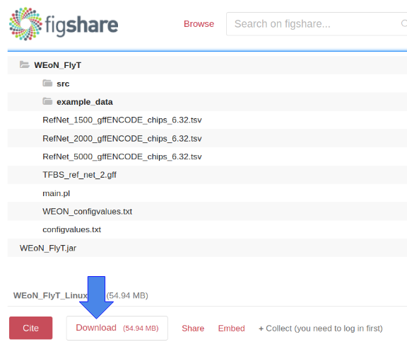
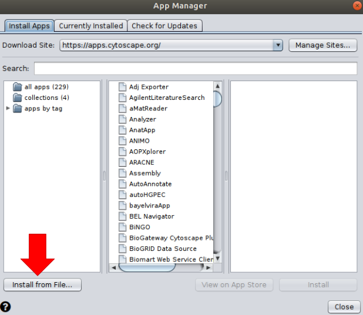
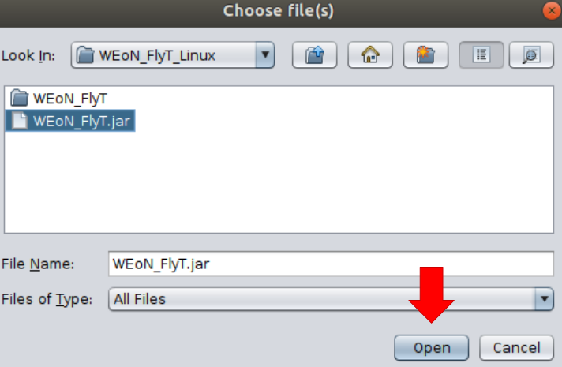
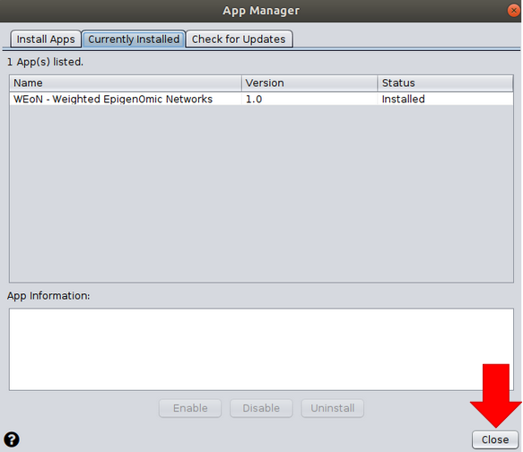

Installation
============

First, be aware that Fly T-WEoN  runs a Perl script that filter out regulations unlikely occurring from a Reference GRN. Please follow specific instructions for your platform to install the Perl interpreter `here <https://www.perl.org/get.html>`_.

.. Also, the app backend is in transition to python, so please also follow intructions to get python3 `here <https://www.python.org/about/gettingstarted/>`_.

**Requeriments**

- Java: Instructions to install Java depends on your operating system. Windows and MacOS users should download Java 8 from `here <https://www.java.com/es/download/manual.jsp>`_ and follow the installer instructions. For Unix users, Java could be installed from the repository packages `openjdk-8-jdk` and `openjdk-8-jre` (e.g. `apt-get install openjdk-8-jdk openjdk-8-jre`).

- Cytoscape: Download the Cytoscape software from `here <https://cytoscape.org/download.html>`_. The webpage will automatically determine your operating system and prompt a download button.

- Perl: Similarly to Java, Windows users should install a Perl interpreter. Please download from `here <http://strawberryperl.com/>`_ and follow the instructions. For MacOS and Unix operating systems, Perl can be already installed; if not, the user can install it from the repository.

**Getting Fly T-WEoN**

Fly T-WEoN is freely available to download from **Figshare**. Fly T-WEoN can be used in several operating systems (Linux, Windows and macOS) and you need to download a specific version (in zip format) of the tool for your operating system (OS).

- Fly T-WEoN for Linux `download here <https://figshare.com/articles/WEoN_FlyT_for_Linux/11956758>`_

- Fly T-WEoN for Windows `download here <https://figshare.com/articles/WEoN_FlyT_for_windows/11958972>`_

- Fly T-WEoN for Mac `download here <https://figshare.com/articles/WEoN_FlyT_for_mac/11958942>`_

Once you are in the download page, you can get the tool by cliking on the **download button** as is shown in the following image.

**Installation**

With the corresponding zip file for your OS, you need to uncompress it. After completion, you have now a subdirectory called *WEoN_FlyT*, which correspond to the scripts executed by WEoN FlyT and the *WEoN_FlyT.jar* file corresponding to the Cytoscape app. The jar file contains a graphical user interface (GUI) that allows to Cytoscape execute the filtering process encoded in Fly T-WEoN.

In order to install the scripts and the GUI, you need to do the following steps for the main folder and for the cytoscape app:

1. **WEoN_FlyT directory:**
Fly T-
- Linux users: copy the folder to */home/your_username*

- Windows users: copy the folder to *C:*

- MacOS users: copy the folder to */Users/your_username*

.. note::
	**Additional instructions for Windows users:**
	In some Windows operating systems, copying WEoN FlyT folder could require for admin permissions. For this case, we included an **installation.bat** file, which automatically will ask for these permissions and then will generate a copy of the folder in the *C:* directory.

2. **WEoN_FlyT.jar file:** In order to install the GUI, you need to open Cytoscape and then navigate to *Apps menu >> App Manager* and click on *Install from File*, as it is indicated in the following image.

Clicking on the *Install from file* button will open a new window where you need to navigate to the directory containing the jar file and select it as shown in the next image.

After selecting the jar file, the resulting proccess will be similar to the shown in the next image, and the installation process is finalized by clicking on the *close* button.

Now you only need to go to the *Apps menu*, click on *Fly T-WEoN - Fly Tool Weighted Epigenomic Network* to start to use the tool.

.. note::
	**Need Help?**
	If you run into any problems with installation, please leave an issue in the
	official `Github repository <https://github.com/networkbiolab/WEoN>`_.
