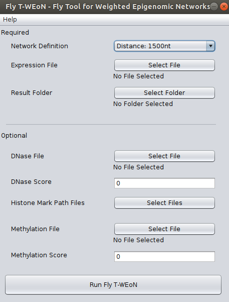
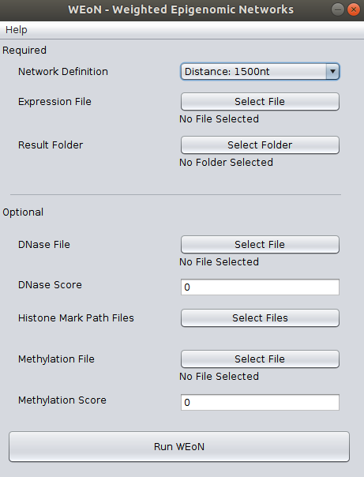

Instructions to use Fly T-WEoN
==============================

This document contains the main instructions in order to use the **Fly T-WEoN (Fly Tool for Weighted Epigenetic Networks)** Cytoscape app.

1. **Open the Fly T-WEoN app**

Within Cytoscape, go to Apps >> Fly T-WEoN - Fly Tool for Weighted Epigenomic Network. This will display the user interface as shown in the figure.

2. **Interface**
The Fly T-WEoN interface is an input screen where the user complete required and optional data. In the backend, Fly T-WEoN executes Perl scripts, therefore parsing correctly the data to arguments and call orderly the scripts to filter out unlikely ocurring gene regulations from a reference gene regulatory network.

.. note::
	There is a known issue occurring in MacOS. Users has reported that the *Network Definition* selector is not shown. However, the selector is still there; you only need to click on in this *blank space* and the menu will be displayed to select a network definition.

.. .. note::
.. .. 	We will improve the annotation of histone marks associating each mark to an
.. .. 	experimentally validated effect on specific DNA sequences like promoters. For
.. .. 	the current release of WEoN, the 3rd column don't interfere with the filtering
.. .. 	process.

- **Required data**

In order to use Fly T-WEoN, you need to provide at least three required data as listed as follow:

	1. **Network Definition**: This field corresponds to the reference GRN to which apply filters to generate the weighted GRN. We provide three references networks, which were constructed within a different cut-off of 1500, 2000, and 5000 nucleotides: if a Transcription Factor Binding Site or other regulatory element is contained in the cut-off upstream the Transcription Start Site of Drosophila melanogaster genes, then the GRN defines a connection between gene and regulator.

	2. **Expression File**: Fly T-WEoN employs RNA-seq data to filter out absent transcription factors and miRNAs from the Reference GRN. The RNA-seq data must be provided formatted in a two-columns file separated by tabulations. The first column is the gene name while the second is the expression of the corresponding gene. Expression could be reported as read counts, reads per kilobase million (RPKM) or fragments per kilobase million (FPKM). Data must be a single experiment or the average value of the experimental replication.

	.. 	Fly T-WEoN use an internal dictionary to match gene names from the Reference Network and the Expression File. ES NECESARIO?

	3. **Result folder**: A folder where results will be placed.

- **Optional data**

If you have data from DNase (or ATAC-seq), Histone modifications and/or methylation experiments, you can use it to complement RNA-seq data and get a more specific Gene Regulation Network.

So, for the ``DNase file`` and ``Methylation file`` fields, you need to provide four-columns files separated by tabulations. Each column correspond, in order, to the chromosome, the initial coordinate, the ending coordinate, and the score for the mapped feature. Both files has an associated ``Score`` field used as a threshold value to dismiss lower score values from the original data. Default is zero, which means that all mapped features in the DNase and Methylation files will be used in the filtering process.

Respect to the ``Histone Mark Path Files`` button, once you click it a new window will appear as shown in the next image, so in this new window you can select files for the corresponding post-translational modification of histone tails. Each data must be a three-columns files separated by tabulations, where each column correspond to the chromosome, the initial coordinate, and the ending coordinate of the mapped feature.

3. **Execute filtering and visualization of results**

After all data is selected, please click on ``Run Fly T-WEoN``. The weighted GRN will be loaded in Cytoscape with the ``Create View`` button to display the time and/or tissue specific GRN.

.. note::
	It is important to remark that the filtering process could take a long time depending on your machine hardware and the number of files and information on them provided to Fly T-WEoN. Please be patient.

4. **Details of the Output Files**

A set of files are created after executing Fly T-WEoN, which are located in the folder selected as output. These files are described as follow:

- *output_filter_PTMs.txt*: A file describing information about chromosome, id of the coding gene for the transcription factor (TF), starting coordinate of the transcription factor binding site (TFBS), ending coordinate of the TFBS, name of the post-translational modification (PTM) of histone tails (histone marks), starting coordinate of the PTM, ending coordinate of the PTM, open or closed chromatin state (represented as + or -) and place where the PTM was found (on the promotor region, P, or on the gene, G)

- *output_connect.txt*: A file describing information about PTMs. In the first column is the connection in the Gene Regulatory Network (GRN) and the second has info about PTM and the number of times that PTM was found and affecting the connection.

- *output_connection_analysis.txt*: A file describing all PTMs affecting the binding of a TF.

- *output_regulator_express.tsv*: A file describing connections from expressed regulators to genes.

- *output_regulator_no_express.tsv*: A file describing connections from non-expressed regulators to genes.

- *output_mirna_express.tsv*: A file describing connections from expressed miRNAs to genes.

- *output_mirna_no_express.tsv*: A file describing connections from non-expressed miRNAs to genes.

- *out_TFBS_network.tsv*: A copy of the reference GRN used as input.

- *specific_GRN.tsv*: A file that merge *output_regulator_express.tsv* and *output_mirna_express.tsv* results.

- *scored_GRN.tsv*: Same as *specific_GRN.tsv*, except for this file include information about the calculated score of the connection. This score is based on a set of filters (based on Expression, DNase, histone marks, and Methylation) indicating the evidence for the regulatory interaction. Importantly to note is that the scale for the evidence score go from one to five (only if all four types of experiments were provided by the user).

.. note::
	If you close Cytoscape and need to visualize again the weighted GRN, please import the **specific_GRN.tsv** or **scored_GRN.tsv** into Cytoscape.

.. note::
	Feel free to contact directly throught the `Github repository <https://github.com/networkbiolab/WEoN>`_
	or to Dr. Alberto Martin's `e-mail <alberto.martin@umayor.cl>`_.
