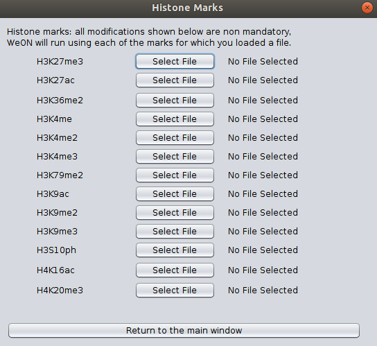

Instructions to use WEoN
========================

This document contains the principal instructions in order to use the Cytoscape
app **WEoN FlyT (Weighted Epigenetic Networks: Fly Tool)**. 

0. **Open WEoN**

   Within Cytoscape, go to: Apps >> WEoN FlyT - Weighted Epigenomic Network: Fly Tool. This will display the user interface as shown in the figure.

1. **Interface**

The WEoN FlyT interface is a simple selector screen that serves as input screen. In the backend, WEoN FlyT run under Perl scripts, therefore parsing correctly the genomic data and calling orderly the scripts to filter out unlikely ocurring regulations.

.. image:: images/interface.png
	:align: center

2. **Required data**

WEoN FlyT use RNA-seq data to filter out absent transcription factors and miRNAs from the Reference Gene Regulatory Network (GRN). We provide three References,which were constructed within a differente cutoff of 1500, 2000, and 5000 nucleotides from the Transcription Start Site of the Drosophila melanogaster genome.

   Please select a two-column file separated by tabulations as an ``Expression File``.
   The first column is the gene name while the second is the expression in any
   unit, like counts, RPKM, or FPKM. WEoN FlyT use an internal dictionary to match gene
   names from the Reference Network and the Expression File. Data must be a single
   experiment or the average value of the experimental replication.

   We provide ``expression_test.tsv`` as an example ``Expression File``. Please
   click on the corresponding ``Select File`` button and navigated to the containing
   folder. Also, provide a path (with write permission) from the ``Select Folder``
   button: click on and navigate.

.. note::
	The resulting Gene Regulatory Network will be stored at the user selected path
	from the ``Select Folder`` button. Although, the GRN will be loaded automatically
	when WEoN finish the filtering processes, the user can reuse the GRN.

3. **Optional data**

   ``DNase file`` and ``Methylation file`` are four-columns files separated by
   tabulations. Each column correspond, in order, to the chromosome where was mapped
   the sequence, the initial coordinate, the ending coordinate, and the score for
   the mapped feature. Both files has an associated ``Score`` block which the user
   can use a threshold value where all lower scores are dismissed. Default is zero,
   meaning all mapped features in the ``DNase`` and ``Methylation`` files will
   be used in the filtering process.

   The ``Histone Mark Path Files`` allows the introduction of a single file that
   determine the absolute path to ChIP-seq experiments for each histone post-
   tranlational modification. The file is a four-column text as follow:

..    .. code-block:: bash
..
.. 		mark		state	annotation	location
.. 		H3K27me3	-		promoter	/absolute/path/to/example_data/H3K27me3_0-4hr.bed
.. 		H3K27ac		+		promoter	...
.. 		H3K36me2	+		promoter	...
.. 		H3K36me3	+		promoter	...
.. 		H3K4me1		+		promoter	...
.. 		H3K4me2		+		promoter	...
.. 		H3K4me3		+		promoter	...
.. 		H3K79me2	+		promoter	...
.. 		H3K9ac		+		promoter	...
.. 		H3K9me2		+		promoter	...
.. 		H3K9me3		+		promoter	...
.. 		H3S10ph		+		promoter	...
.. 		H4K16ac		+		promoter	...
.. 		H4K20me3	-		promoter	...

.. .. note::
.. 	We will improve the annotation of histone marks associating each mark to an
.. 	experimentally validated effect on specific DNA sequences like promoters. For
.. 	the current release of WEoN, the 3rd column don't interfere with the filtering
.. 	process.

4. **Execute filtering**

   After all the data is loaded, please click on ``Run WEoN FlyT``, wait, and
   It is important to note that when the job is finished, you need to click on ``Create View`` button to display the time/tissue specific GRN in Cytoscape.

.. note::
	Feel free to contact directly throught the `Github repository <https://github.com/networkbiolab/WEoN>`_
	or to Dr. Alberto Martin's `e-mail <amartin@umayor.cl>`_.

